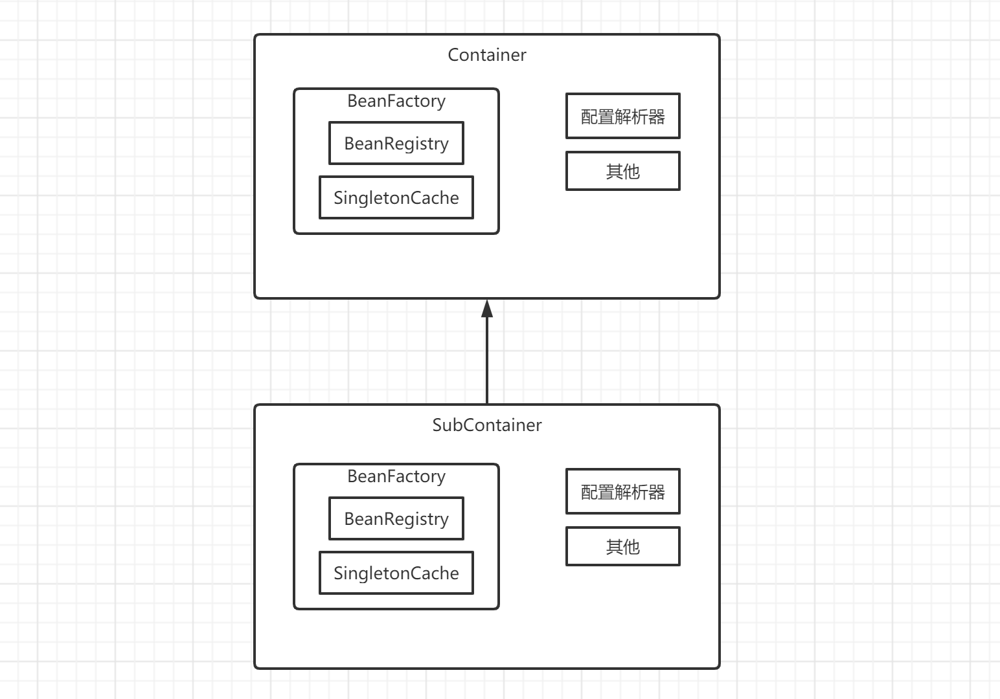

# nanny
一个简单的依赖注入容器（a simple dependency injection container）

## 初衷
实习时导师要求我研究一下依赖注入容器并试着自己手写一个，我一听，好家伙，又是加班的一天啊。

当时用的是C#，就翻了翻IServiceCollection的源码，梳理了一下流程，发现其实核心逻辑并不复杂，就是通过反射将你需要的对象构造出来，如果构造期间需要其他对象，就递归进行，先构造依赖项。如果对象 的生命周期是singleton，就用一个map存起来后续直接获取。

一番研究后，还真让我写出来了，虽然代码很少，逻辑也很粗糙，但是总归实现了简单的IOC和DI功能，还有就是实现了容器的作用域，在不同作用域中可以拿到相同或者不同的实例，导师看了也觉得不错。

实习结束回到学校，就想着用我比较熟悉的Java语言重构一遍，刚好也缺一个毕业设计，于是就有了nanny。

## 需求
* 控制反转（多种注册类型）
  * 注册一个类
  * 注册一个对象
  * 注册一个Provider
* 依赖注入
  * 手动注入
  * 自动注入
  * 通过构造器注入
  * 通过属性注入
* 支持循环依赖
* 支持不同生命周期（singleton、prototype）
* 支持不同配置方式
  * 编程方式
  * xml配置方式
  * 注解方式
* 支持父子容器

## 架构思路
参考了Spring的设计，使用'Bean'这个单词作为容器中托管的实例单元，使用`BeanDefinition`来描述一个`Bean`的全部信息，包括类型、名称、实例、生命周期、属性参数、构造器参数等，使用`BeanFactory`接口获取`Bean`。

在`BeanFactory`中有两个重要的组件：`BeanRegistry`和`SingletonCache`，其中`BeanRegistry`用来存储已经注册到该`BeanFactory`中的所有`BeanDefinition`，并提供类型和名称索引。`SingletonCache`用来存储所有已经实例化过的singleton类型的对象，为了解决循环依赖问题以及今后可能会支持的aop功能，`SingletonCache`模仿了Spring的三级缓存。

目前`BeanFactory`本身已经实现了IOC和DI功能，但是为了支持更多元化的配置方式和引入父子容器的概念，我使用`Container`将`BeanFactory`包裹起来，`Container`派生自`BeanFactory`同时内部组合了一个`BeanFactory`，不同的`Container`实现可以提供了多元化的注册`Bean`的方法，比如编程方式、xml配置方式、Json配置方式、注解方式等等。还可以为一个`Container`指定一个父级`Container`实现父子容器。

结构图大致如下：

在从容器中获取某一个`bean`时，只需调用`Container`的`getBean()`方法，该方法中又是调用的`BeanFactory`的`getBean()`方法，先从`BeanRegistry`中查找对应的bean定义，如果没有就调用父级工厂的`getBean()`方法。如果存在bean定义，就查找`SingletonCache`看有没有缓存，有缓存直接返回，没有就调用createBean()方法创建一个，创建过程通过反射完成，先通过构造函数创建实例，然后加入三级缓存，然后注入属性，如果生命周期是singleton就将其加入一级缓存，最后返回创建好的bean。

时序图大致如下：

## 简单上手

### 使用前声明：
由于在使用构造器注入的时候可能使用到参数名，而jdk默认的是反射拿不到这些参数名，所以在编译时需要额外添加-parameter参数，例如 javac -parameter xxx.java，如果使用maven的话，需要在pom.xml中添加
如下配置：
```xml
<build>
        <plugins>
            <plugin>
                <groupId>org.apache.maven.plugins</groupId>
                <artifactId>maven-compiler-plugin</artifactId>
                <version>3.8.1</version>
                <configuration>
                    <source>11</source>
                    <target>11</target>
                    <compilerArgument>-parameters</compilerArgument>
                </configuration>
            </plugin>
        </plugins>
    </build>
```
### 用例准备
现在假设系统由三个组件组成：Repository、Service、Controller，具有如下接口和实现类：
```java
public interface Repository {}
public class RepositoryImpl implements Repository   {}

public interface Service {
  Repository getRepository();
  void setRepository(Repository repository);
}
public class ServiceImpl implements Service {
  private Repository repository;
  public ServiceImpl(Repository repository) {
    this.repository = repository;
  }
  @Override
  public Repository getRepository() {
    return repository;
  }
  @Override
  public void setRepository(Repository repository) {
    this.repository = repository;
  }
}

public class Controller {
  private Service service;
  public Service getService() {
    return service;
  }
  public void setService(Service service) {
    this.service = service;
  }
}
```

### 使用编程方式
```java
public class GenericContainerClient {
  public static void main(String[] args) {
    // 创建一个通用IOC容器
    Container container = new GenericContainer();
    // 向容器中注册一个Repository的实现类，命名为"repository"。
    // 本次注册方式只需提供类型和名称就行，生命周期默认singleton。
    container.registerBean(RepositoryImpl.class, "repositoryBean");

    // 手动构造一个bean定义，指定类型和名称以及构造器参数。
    var serviceDefinition = new BeanDefinition(ServiceImpl.class, "serviceBean", BeanLifecycle.SINGLETON);
    // 指定构造器参数“repository”将被注入名为“repositoryBean”的bean实例。
    serviceDefinition.getConstructorArguments().put("repository", new InjectValue("repositoryBean"));
    // 将该bean定义注册到容器
    container.registerBean(serviceDefinition);

    // 手动构造一个Controller类型的bean定义，指定名称为“controllerBean”，默认生命周期为singleton。
    var controllerDefinition = new BeanDefinition(Controller.class, "controllerBean");
    // 指定属性“service”将被注入名为“serviceBean”的bean实例。
    controllerDefinition.getInjectProperties().put("service", new InjectValue("serviceBean"));
    // 将该bean定义注册到容器
    container.registerBean(controllerDefinition);

    // 测试是否成功构造依赖关系

    // 先分别从容器中取出各个实例
    Repository repository = container.getBean(Repository.class, "repositoryBean");
    Service service = container.getBean(Service.class, "serviceBean");
    Controller controller = container.getBean(Controller.class, "controllerBean");

    // 然后验证依赖是否注入正确
    assert service.getRepository() == repository;
    assert controller.getService() == service;
  }
}
```

### 使用xml文件方式
在classpath下创建beans.xml文件内容如下：
```xml
<?xml version="1.0" encoding="UTF-8" ?>
<beans>
    <bean name="repository" class="nanny.demo.model.RepositoryImpl" lifecycle="singleton"/>

    <bean name="service" class="nanny.demo.model.ServiceImpl">
        <argument name="repository" reference="repository"/>
    </bean>

    <bean name="controller" class="nanny.demo.model.Controller">
        <property name="service" reference="service"/>
    </bean>
</beans>
```
```java
public class XmlConfigContainerClient {
    public static void main(String[] args) {
        // 通过xml配置文件初始化容器
        Container container = new XmlConfigContainer("beans.xml");
        
        // 测试是否成功构造依赖关系

        // 先分别从容器中取出各个实例
        var repository = container.getBean(Repository.class, "repository");
        var service = container.getBean(Service.class, "service");
        var controller = container.getBean(Controller.class, "controller");

        // 然后验证依赖是否注入正确
        assert service.getRepository() == repository;
        assert controller.getService() == service;
    }
}
```

这是目前支持的两种配置方式，未来还打算支持注解驱动方式。

关于其他的用法细节，以后慢慢更新。